# Library Application

A library offers its subscribers a list of books that can be borrowed. For each subscriber we retain information about CNP (CPN),name, address, phone and unique code of user within the library. Each book can exist in one or more copies identified through unique codes. The library contains:
• Several terminals where subscribers can borrow books. In order to use a terminal, a subscriber must log in . After authentication, they see a list of books available at the time and the user can choose to borrow one or more copies.
• One terminal: To return your rental the customer needs to go to a librarian which can connect to this terminal. All library terminal users see the updated list of available books.

## [For a more in-depth presentation please check the documentation!](https://github.com/deeaion/Library-Application/tree/main/Documents)

# A quick presentation

## Admin/User/Librarian view

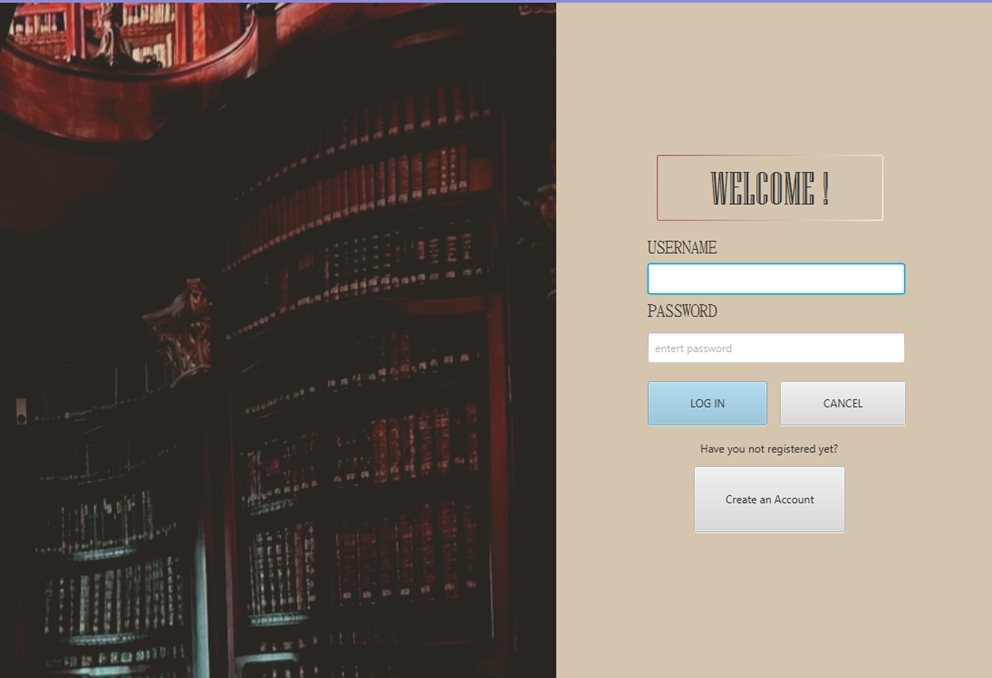
Sign up
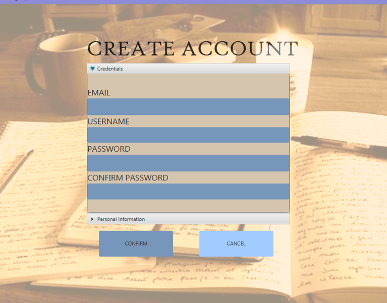

## User view

Main page
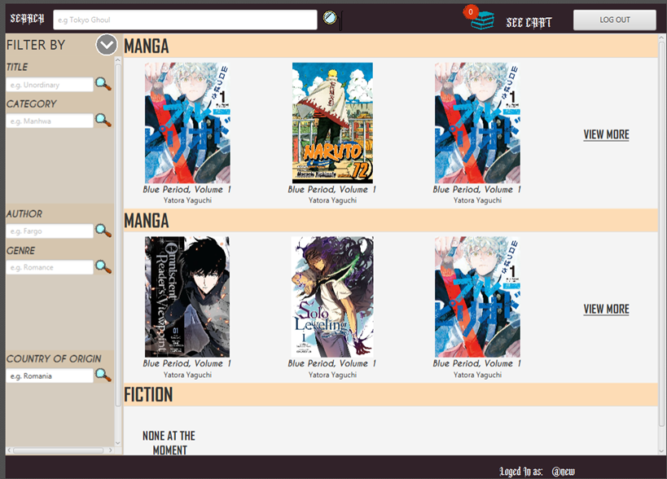
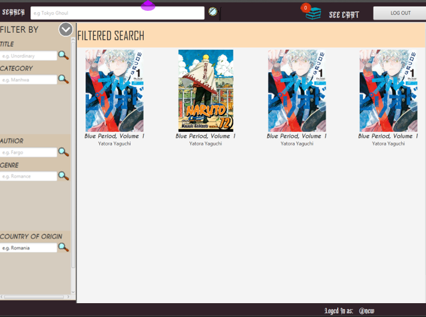
Preview of the book
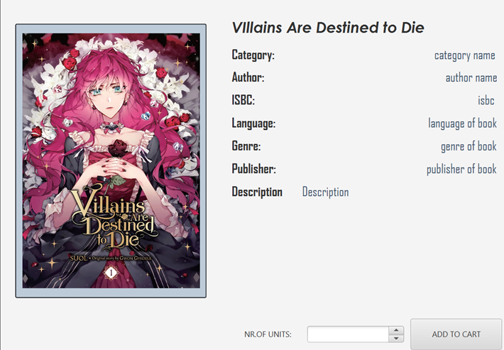
Basket
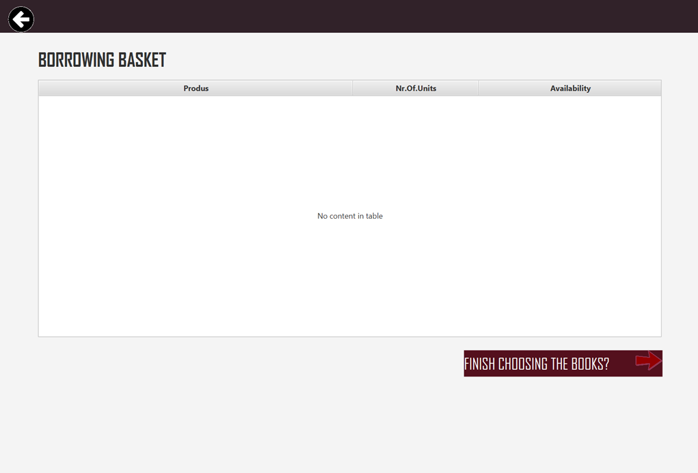

## Librarian view

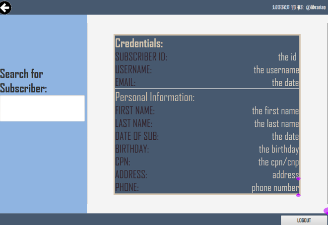
Subscriber Rental Information
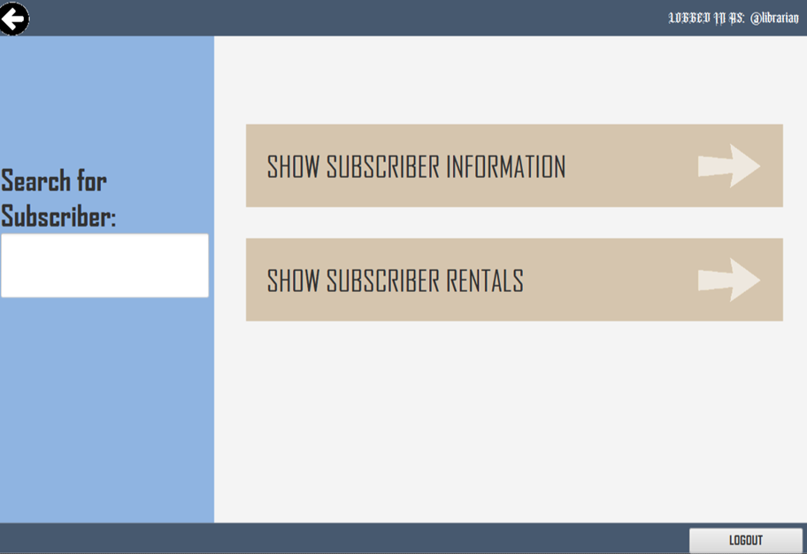
Admin view is really basic
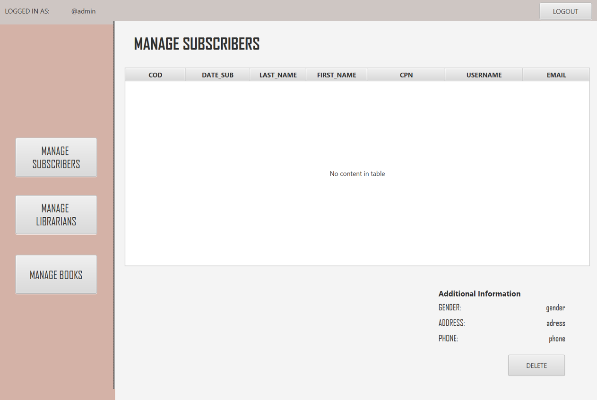
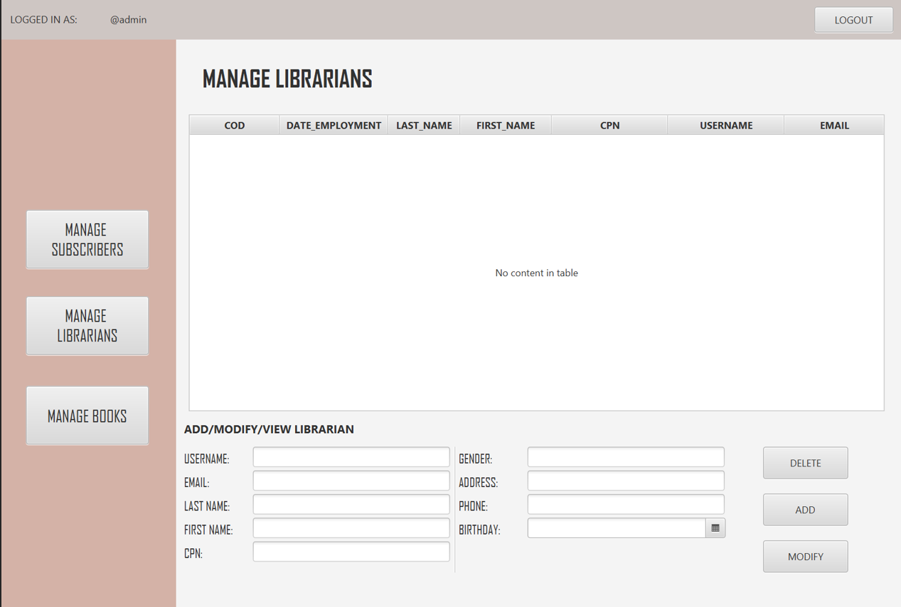
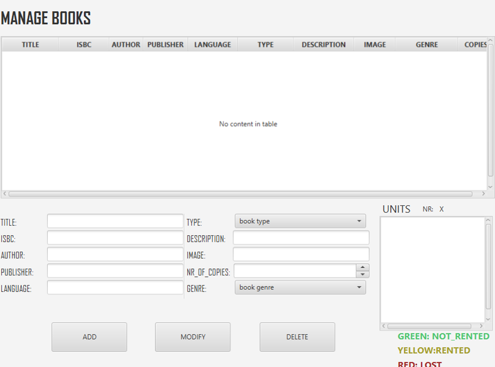
